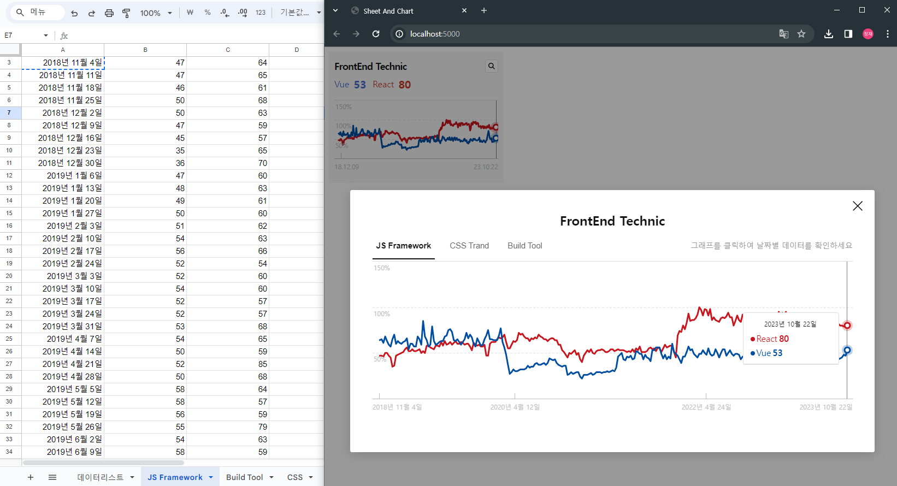

# Sheet And Chart

## Document Notes

This is a small project using google sheet, highChart, and papaparse.<br>
Create a chart from what is written in Google Sheets.

- Node version used is 18.16.1 🔥


  
## Demo
- Demo : [URL Click🔥](jayj-fe.github.io/sheetAndChart/)

## Tech stack

- Gulp 
- Vanilla Js
- HighChart Library
- Papaarse Library
- SCSS
- Google Sheet

## Install

- npm install
``` sh
$ npm install
```

- gulp server start
``` sh
$ gulp
```